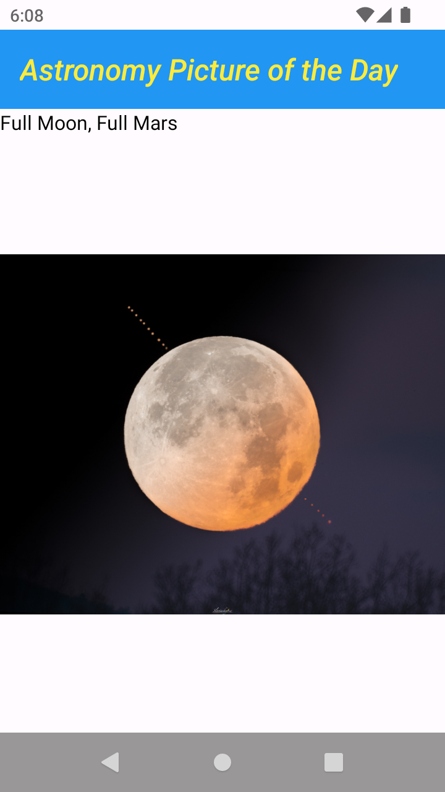
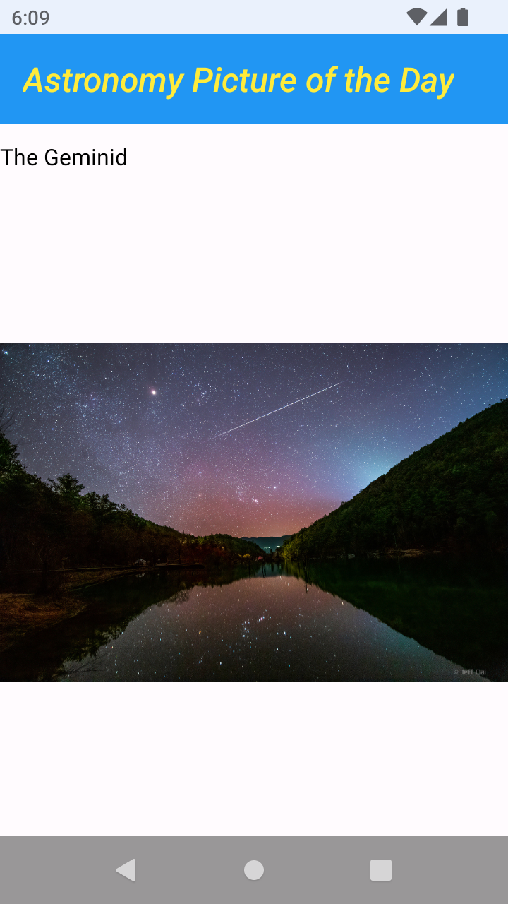
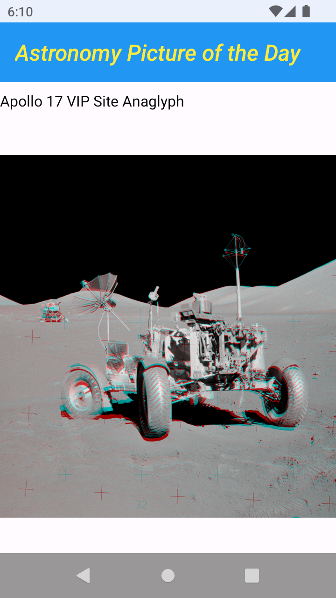
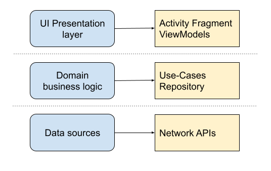
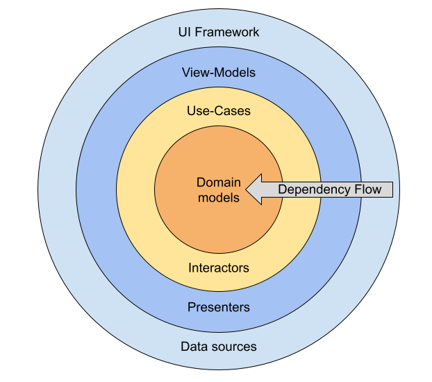

# Android Mobile - Clean Architecture (Work In Progress)

Sample Android project demonstrates the list of pictures:
[Astronomy Picture of the Day ](https://apod.nasa.gov/apod/astropix.html)

  

Generate [NASA developer key](https://api.nasa.gov/) necessary to get access to the data and run the application. 
- Add "API_KEY" to build properties.

## Application architecture
The project is structured in a three-layer pattern fitting the [official Google recommendation](https://developer.android.com/topic/architecture).
The dependency flow is always one direction from the outer towards the inner circles according to Uncle Bob's [Clean Architecture](https://blog.cleancoder.com/uncle-bob/2012/08/13/the-clean-architecture.html).

 

## List of Google Android libs
- [Androidx:core-ktx](https://developer.android.com/kotlin/ktx): Kotlin extensions that are part of the Android framework.
- [Androidx:appcompat](https://developer.android.com/jetpack/androidx/releases/appcompat): Access to new APIs from older platform versions.
- [Android.material](https://m3.material.io/develop/android/mdc-android): Guidelines for the visual and interaction design.
- [Dagger.Hilt](https://developer.android.com/training/dependency-injection/hilt-android): Dependency injection that reduces the boilerplate.

## List of 3rd party libraries
- [Coil (image loading)](https://coil-kt.github.io/coil/): Image loading library for Android backed by Kotlin Coroutines.
- [Kluent (testing)](https://github.com/MarkusAmshove/Kluent): Fluent around the JUnit-Assertion-Library for Kotlin.
- [Retrofit (networking)](https://square.github.io/retrofit/): A type-safe HTTP client for Android and Java/Kotlin.
